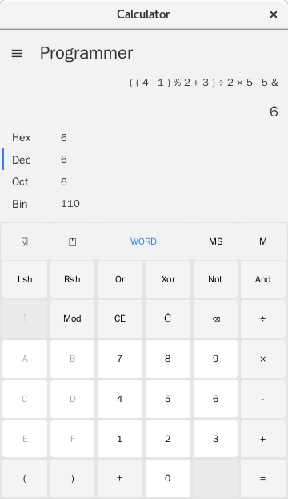

## Calculator Windows 10

* support radix conversion
* support wordsize conversion
* support complex arithmetic expression by using reverse polish notion.

Compile:

```
javac --module-path $MODULEPATH --add-modules javafx.controls Calculator.java 
```

Run:
```
java --module-path $MODULEPATH --add-modules javafx.controls Calculator
```


